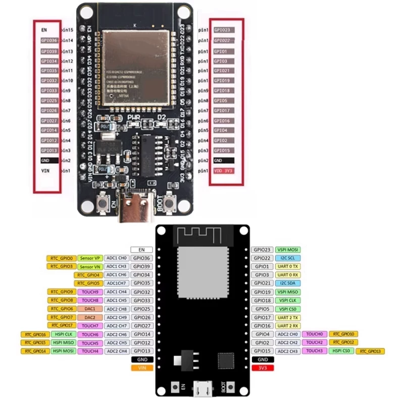

# ESP32-WROOM-32 开发板 (DevKitC)

[← 硬件文档索引](../HARDWARE.md)

板型：**ESP32 开发板**（ESP32-DevKitC 风格，搭载 ESP32-WROOM-32 模块）。



```
尺寸: 51.85 × 23.5 mm（常见 DevKitC 类开发板）
引脚: 左列 15pin + 右列 14pin, 2.54mm 间距, 双排间距约 23.5mm
安装孔: 4× φ3mm, 距边 3mm
USB: USB-C / Micro-USB（视具体批次）
```

## 左侧引脚（从上到下，丝印对照）

| 序号 | 引脚 | 功能说明 |
|------|------|----------|
| 1 | **3V3** | 3.3V 电源输出 |
| 2 | **EN** | 使能/复位引脚（高电平有效） |
| 3 | **GPIO36 (VP)** | ADC1_CH0，仅输入 |
| 4 | **GPIO39 (VN)** | ADC1_CH3，仅输入 |
| 5 | **GPIO34** | ADC1_CH6，仅输入 |
| 6 | **GPIO35** | ADC1_CH7，仅输入 |
| 7 | **GPIO32** | ADC1_CH4 / TOUCH9 |
| 8 | **GPIO33** | ADC1_CH5 / TOUCH8 |
| 9 | **GPIO25** | ADC2_CH8 / DAC_1 |
| 10 | **GPIO26** | ADC2_CH9 / DAC_2 |
| 11 | **GPIO27** | ADC2_CH7 / TOUCH7 |
| 12 | **GPIO14** | ADC2_CH6 / TOUCH6 / MTMS |
| 13 | **GPIO12** | ADC2_CH5 / TOUCH5 / MTDI |
| 14 | **GND** | 接地 |
| 15 | **VIN** | 外部电源输入（5V） |

## 右侧引脚（从上到下，丝印对照）

| 序号 | 引脚 | 功能说明 |
|------|------|----------|
| 1 | **GPIO23** | VSPI MOSI |
| 2 | **GPIO22** | I2C SCL（时钟） |
| 3 | **GPIO21** | I2C SDA（数据） |
| 4 | **GND** | 接地 |
| 5 | **GPIO19** | VSPI MISO |
| 6 | **GPIO18** | VSPI SCK（时钟） |
| 7 | **GPIO5** | VSPI SS / TOUCH5 |
| 8 | **GPIO17** | UART2 TXD（发送） |
| 9 | **GPIO16** | UART2 RXD（接收） |
| 10 | **GPIO4** | TOUCH0 / ADC2_CH0 |
| 11 | **GPIO2** | TOUCH2 / ADC2_CH2 / 板载 LED |
| 12 | **GPIO15** | U0 RTS / TOUCH3 / ADC2_CH3 |
| 13 | **GND** | 接地 |
| 14 | **3V3** | 3.3V 电源输出 |

## 引脚使用注意事项

1. **GPIO34~39** 是**仅输入**引脚，没有输出能力，也没有内部上拉/下拉电阻
2. **GPIO6~11** 已被板载 SPI Flash 占用，**不建议使用**
3. **GPIO12** 在上电时会影响 Flash 工作电压（MTDI），建议上电时保持低电平
4. **GPIO0** 是下载模式引脚（板子底部有 BOOT 按钮），上电时拉低进入下载模式
5. 板载 LED 通常连接在 **GPIO2** 上

## 本设计使用

| 信号 | GPIO | 2×15 Pin# | DevKitC 位置 | 用途 |
|------|------|-----------|--------------|------|
| SDA | GPIO4 | **25** | 右列 Pin 10 | MPU6050 I2C 数据 |
| SCL | GPIO5 | **22** | 右列 Pin 7 | MPU6050 I2C 时钟 |
| INT | GPIO2 | **26** | 右列 Pin 11 | MPU6050 运动中断唤醒 |
| 3V3 | 3V3 | **1** | 左列 Pin 1 | 供 MPU6050 |
| VIN | VIN | **15** | 左列 Pin 15 | PM11 5V（经滑动开关） |
| GND | GND | **14, 19, 28** | 左14 / 右4、13 | 共地铺铜 |

> **KiCad 载板**使用 **2×15 统一编号**（Pin 1–30），见 [`pinout.md`](../pinout.md)。

**设计注意：**

- 本设计 I2C 用 **GPIO4/GPIO5**，非 DevKitC 默认的 GPIO21/22；固件需 `Wire.begin(4, 5)`（Arduino）或指定 SDA/SCL 引脚（ESP-IDF）
- **GPIO2** 与板载 LED 共用，MPU6050 中断时 LED 可能随动
- **GPIO12** 上电时勿拉高（Flash 电压选择）；载板 NC 即可
- 收到板后**务必核对丝印**，克隆板排布可能略有差异
